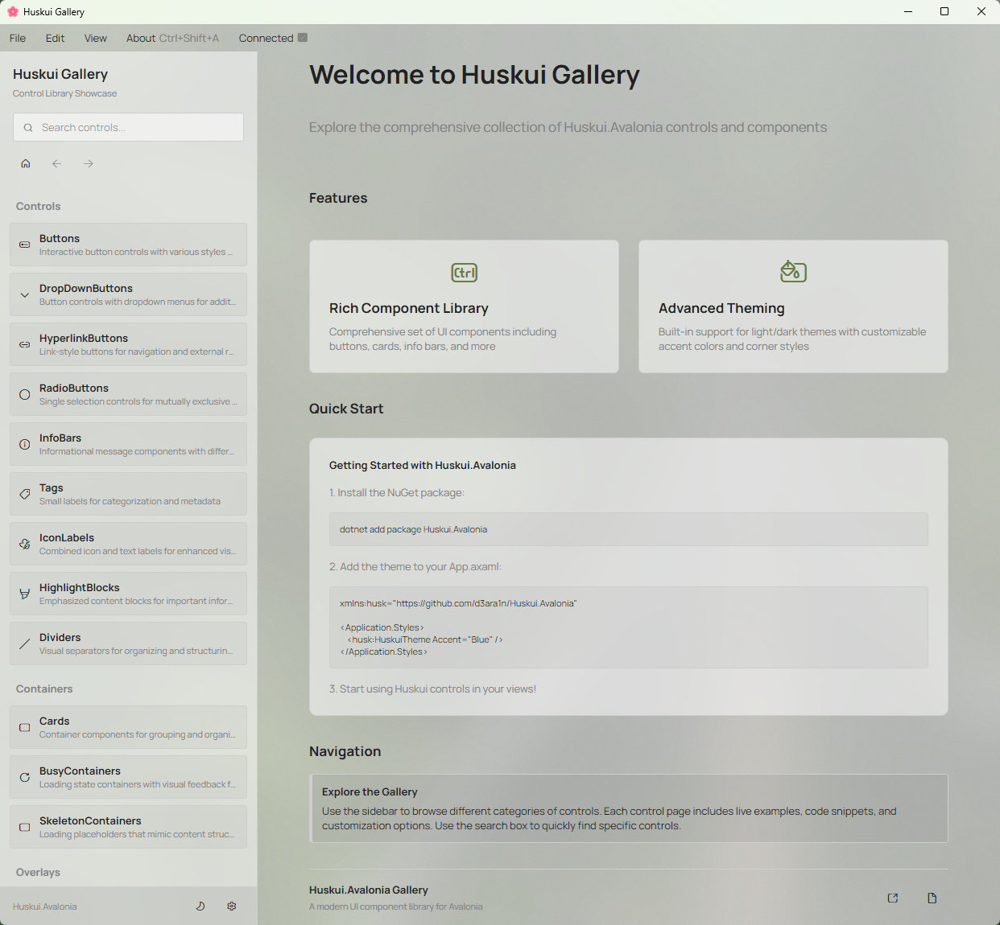

# Huskui.Avalonia

Huskui.Avalonia is a modern, elegant UI component library for [Avalonia UI](https://avaloniaui.net/), designed to
provide a comprehensive set of customizable controls for building beautiful cross-platform desktop applications.
Inspired by [ParkUI](https://park-ui.com/) and using the [Radix Colors](https://www.radix-ui.com/colors) palette.



## Features

- **Rich Component Library**: Includes a wide range of UI components like AppWindow, Card, InfoBar, Tag, IconLabel, and
  more
- **Consistent Design Language**: All components follow a cohesive design system with shared colors, animations, and
  behaviors
- **Theming Support**: Built-in support for light and dark themes
- **Fluent Icons Integration**: Uses FluentIcons.Avalonia for consistent iconography
- **Modern UI Elements**: Includes modern UI patterns like overlays, notifications, and dialogs
- **Customizable**: Easily customize the appearance of components through XAML styles and themes

## Components

Huskui.Avalonia includes the following components:

- **AppWindow**: Enhanced window with built-in support for overlays, toasts, modals, and notifications
- **Card**: Container for grouping related content with consistent styling
- **InfoBar**: Informational message bars with different severity levels
- **Tag**: Compact labels for categorization and metadata
- **IconLabel**: Combined icon and text label with FluentIcons integration
- **Frame**: Navigation container with transition animations
- **HighlightBlock**: Text highlighting for code snippets and keyboard shortcuts
- **GrowlHost** and **GrowlItem**: Toast notification system
- **OverlayHost** and **Modals/Dialogs/Drawers/Toasts**: Overlay management system
- **SkeletonContainer**: Loading placeholder for content
- **BusyContainer**: Container with loading state management
- **LazyContainer**: Component for deferred loading of content
- And many more...

## Gallery

Explore all components and their features in the interactive Gallery application included in this repository. The
Gallery provides live examples, interactive controls, and comprehensive documentation for each component.

To run the Gallery:

```bash
dotnet run --project src/Huskui.Gallery
```

> **Note**: The Gallery application and this README documentation were created entirely by AI to showcase the
> Huskui.Avalonia library. However, the core Huskui.Avalonia control library itself was lovingly crafted by humans (you
> can tell because there are virtually no comments in the library code 😅). The library is production-ready and
> battle-tested, so
> please feel confident using it in your projects!

## Documentation

This project changes frequently, and with limited maintainer bandwidth, we are currently unable to create and
continuously maintain full documentation for every control.

If you need help understanding or using specific controls, AI-assisted development can help you get productive faster.

### AI-assisted workflow

1. Download or clone the source code.
2. Use one of the following approaches:

   - Ask Claude:

     ```text
     Study this repository and explain the difference between Sidebar and Drawer controls, and how to use them.
     ```

   - If you are a Z.AI Coding Plan user, use the [zread.ai](https://zread.ai/d3ara1n/Huskui.Avalonia) MCP to inspect the repository, read source files, and ask
     targeted questions about component usage and implementation details.

Helpful prompt ideas:

- Explain what this control is for and when to use it.
- Compare two similar controls and highlight their differences.
- Show a minimal usage example for a specific control.
- Trace which themes, styles, and supporting classes a control depends on.
- Summarize the public API of a control from the source code.

## Getting Started

### Prerequisites

- .NET 10.0 or later
- Avalonia UI 12.0 or later

### Installation

`dotnet add package Huskui.Avalonia`

### Basic Usage

1. Add the Huskui.Avalonia namespace to your XAML:

```xml
<Application xmlns="https://github.com/avaloniaui"
             xmlns:x="http://schemas.microsoft.com/winfx/2006/xaml"
             xmlns:husk="https://github.com/d3ara1n/Huskui.Avalonia"
             x:Class="YourApp.App">
    <Application.Styles>
        <FluentTheme />
        <husk:HuskuiTheme Accent="Lime" />

        <!-- Optional Addons -->
        <StyleINclude Source="avares://Huskui.Avalonia/Themes/Addons.NoAutoScrollToSelectedItem.axaml" />
        <StyleINclude Source="avares://Huskui.Avalonia/Themes/Addons.InlineUIContainerAlignment.axaml" />
    </Application.Styles>
</Application>
```

1. Use Huskui components in your views:

```xml
<husk:AppWindow xmlns="https://github.com/avaloniaui"
                xmlns:x="http://schemas.microsoft.com/winfx/2006/xaml"
                xmlns:husk="https://github.com/d3ara1n/Huskui.Avalonia"
                x:Class="YourApp.MainWindow"
                Title="Your App">
    <Grid RowDefinitions="Auto,*" Margin="24">
        <husk:Card Grid.Row="0" Margin="0,0,0,12">
            <husk:InfoBar Header="Welcome" Content="This is a sample application using Huskui.Avalonia" />
        </husk:Card>

        <StackPanel Grid.Row="1" Spacing="12">
            <husk:IconLabel Icon="Home" Text="Home" />

            <Button Content="Standard Button" />
            <Button Classes="Primary" Content="Primary Button" />
            <Button Classes="Success" Content="Success Button" />

            <husk:Tag Content="Sample Tag" />
        </StackPanel>
    </Grid>
</husk:AppWindow>
```

## Contributing

Contributions are welcome! Please feel free to submit a Pull Request.

### Development Setup

1. Clone the repository
2. Restore tools: `dotnet tool restore`
3. Open in VS Code and install recommended extensions when prompted

XAML files are auto-formatted on save via [XAML Styler](https://github.com/Xavalon/XamlStyler).

Please ensure your XAML is formatted before submitting a PR.

## License

This project is licensed under the [MIT License](LICENSE).
